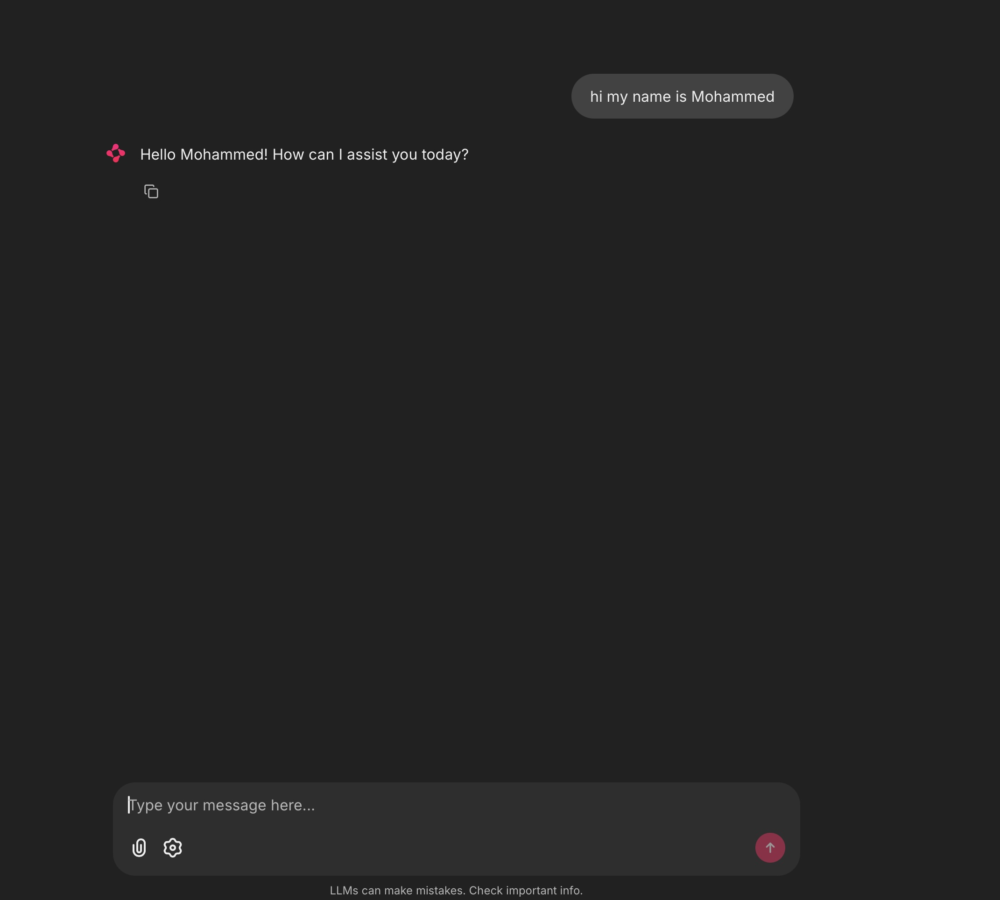
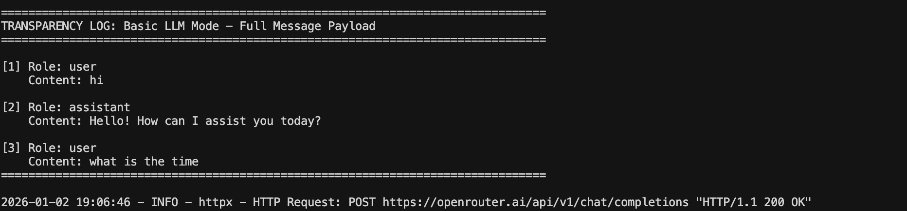
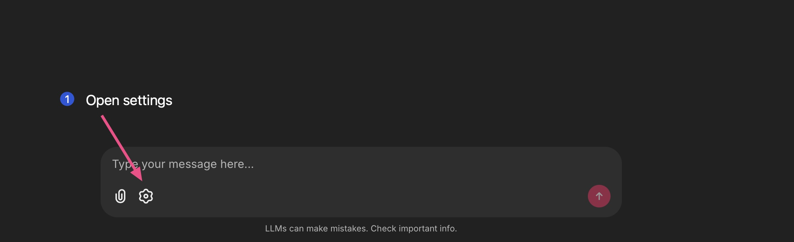
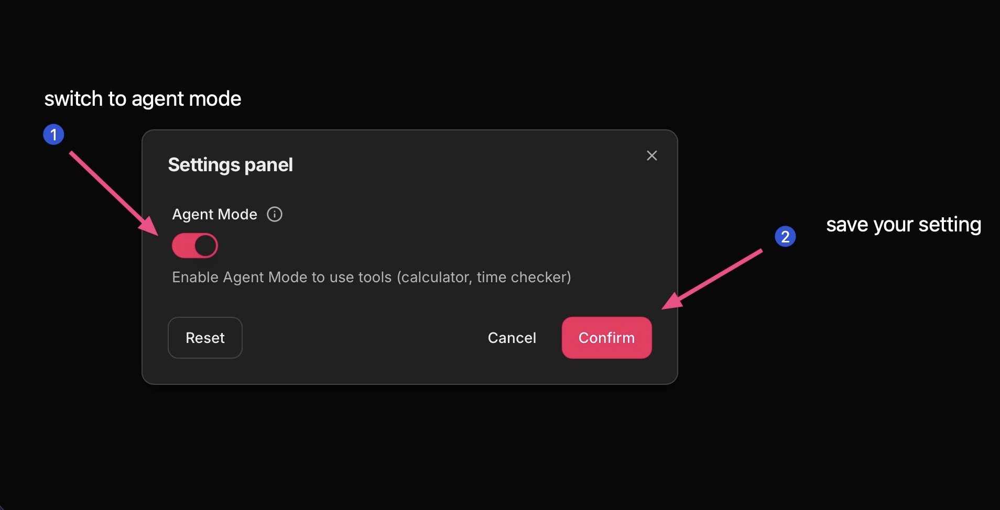
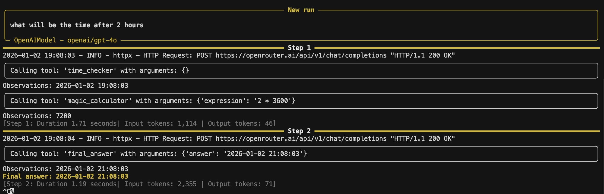

# AI Agent Explorer - Learning Lab

A minimal, transparent Python application designed to help learners understand the difference between a standard LLM and an Agent. This learning repository demonstrates how tools, reasoning loops, and "memory" work in AI systems.

## 🎯 Learning Objectives

After using this lab, learners will understand:

1. **The Stateless Nature of LLMs**: See how "memory" is just a list of text messages passed to the model
2. **Tools as Python Functions**: Learn that agent "tools" are simply Python functions with descriptive docstrings
3. **The ReAct Pattern**: Observe the Reason + Act loop in action through visual thinking steps
4. **API Standardization**: Understand that most AI APIs follow the OpenAI-compatible format

## 📋 Prerequisites

- Python 3.11 or higher
- `uv` package manager ([installation guide](https://github.com/astral-sh/uv))
- OpenRouter API key ([get one here](https://openrouter.ai/keys))

## 🚀 Setup

1. **Clone or download this repository**

2. **Install dependencies using `uv`:**
   ```bash
   uv sync
   ```

3. **Set up environment variables:**
   
   Create a `.env` file in the project directory with any text editor and add this line:
   ```
   OPENROUTER_API_KEY=your_actual_api_key_here
   ```
   
   Replace `your_actual_api_key_here` with your actual OpenRouter API key from https://openrouter.ai/keys

4. **Run the application:**

   You have two options:
   
   **Option A: CLI Version (Recommended for Learning)**
   ```bash
   python main.py
   ```
   Or with `uv`:
   ```bash
   uv run main.py
   ```
   This runs a command-line interface that shows every API call, request, and response transparently. Perfect for understanding how everything works from scratch.
   
   **Note:** The CLI version uses only Python's built-in libraries (no external dependencies required).
   
   **Option B: UI Version (Web Interface)**
   ```bash
   cd App
   uv run chainlit run app.py
   ```
   This runs the web-based UI with Chainlit. The application will start and open in your browser automatically.
   
   **Note:** The first run may take a while as dependencies are downloaded and installed.





## 🎮 Usage

### Two Versions

This lab provides two versions to help you learn:

1. **CLI Version (`main.py`)** - **Recommended for deep learning**
   - Shows raw HTTP requests and responses
   - Uses only built-in Python libraries (no external dependencies)
   - Every API call is transparently displayed
   - Perfect for educators and learners who want to see exactly what's happening
   - No libraries hiding the implementation

2. **UI Version (`App/app.py`)** - **Easy to use web interface**
   - Beautiful web-based chat interface
   - Uses Chainlit for the UI and smolagents for agent logic
   - Great for demonstrations and interactive learning
   - Still shows transparency logs in the terminal

### Two Modes

1. **Basic LLM Mode** (default):
   - Standard chat interface with no tool access
   - Maintains conversation history manually
   - Watch the terminal to see the full message payload before each API call

2. **Agent Mode**:
   - Agent has access to tools (Magic Calculator, Time Checker)
   - Uses reasoning to decide when to call tools
   - Thinking steps are logged to the terminal
   - Terminal shows the message payload for transparency

### Switching Modes

**In CLI Version (`main.py`):**
- Type `basic` or `1` to switch to Basic LLM mode
- Type `agent` or `2` to switch to Agent mode
- Type `quit`, `exit`, or `q` to exit

**In UI Version (`App/app.py`):**
- Use the toggle button in the settings to switch between modes

> **⚠️ Important:** When you switch between modes, the conversation context will be reset. This means previous messages in the current mode will not be available after switching.

> **💡 Cost-Saving Tip:** If you want to ask a question that doesn't need thinking and tooling, please close the Agent Mode to save tokens as it costs too much. Use Basic LLM Mode for simple conversational questions.







### Example Queries

**In Basic LLM Mode:**
- "What is 15 * 23?" (The LLM will try to calculate but has no tools)
- "What time is it?" (The LLM will guess or say it doesn't know)

**In Agent Mode:**
- "What is 15 * 23?" (The agent will use the Magic Calculator tool)
- "What time is it?" (The agent will use the Time Checker tool)

## 🔍 Transparency Feature

This lab includes a **transparency logging** feature. Every time a request is sent to the model, the **full message payload** (the complete conversation history) is printed to the terminal. This demonstrates that:

- LLMs are stateless - they don't "remember" anything
- "Memory" is just a list of text messages passed with each request
- The model sees the entire conversation history as plain text

**In CLI Version (`main.py`):**
- Shows the exact HTTP request (URL, headers, JSON payload)
- Shows the exact HTTP response (full JSON)
- Shows tool execution steps
- Everything is visible - no hidden implementation

**In UI Version (`App/app.py`):**
- Watch your terminal while using the app to see transparency logs
- Full message payloads are printed before each API call

## 📁 Project Structure

```
.
├── main.py             # CLI version - raw Python, transparent API calls (START HERE!)
├── App/                # UI version folder
│   ├── app.py          # Chainlit UI with mode toggle
│   ├── agent.py        # LLM and agent logic with transparency logging
│   ├── tools.py        # Tool definitions (Magic Calculator, Time Checker)
│   └── chainlit.md     # Chainlit welcome screen configuration
├── pyproject.toml      # Project dependencies and configuration
├── .env                # Environment variables (create this file - see Setup)
└── README.md           # This file
```

**Learning Path:**
1. Start with `main.py` (CLI) to understand the fundamentals
2. Then explore `App/` to see how the same concepts work with UI libraries

## 🔧 Customization

Want to add your own tools or change the LLM model in the UI version? Check out the [App/CUSTOMIZATION.md](App/CUSTOMIZATION.md) guide for step-by-step instructions.

**Note:** The CLI version (`main.py`) can be customized by directly editing the code - it's simple enough to modify without a guide!

## 🛠️ Technical Stack

**CLI Version (`main.py`):**
- **HTTP Client**: Built-in `urllib.request` (no external dependencies)
- **No Agent Framework**: Raw Python implementation showing exactly how agents work
- **Transparency**: Every API call, request, and response is shown

**UI Version (`App/`):**
- **Package Manager**: `uv` for fast Python package management
- **Agent Framework**: `smolagents` (Hugging Face) - minimal, transparent agent implementation
- **UI Framework**: `chainlit` - modern chat interface

**Both Versions:**
- **LLM Provider**: **OpenRouter** - unified API for multiple models
- **Model**: Uses OpenAI-compatible API via OpenRouter

## 🎓 For Educators

This repository is designed to be "bomb-proof" - meaning:

- No over-complicated libraries hiding the core concepts
- All logic is transparent and easy to understand
- Functional programming style where possible
- Clear separation of concerns (UI, agent logic, tools)
- Terminal logging shows exactly what's happening under the hood

Learners can read the code and understand:
- How message history is maintained
- How tools are defined and called
- How the agent decides when to use tools
- How the model API works

## 📝 Notes

- The terminal transparency logs are crucial for understanding how LLMs work
- Switching modes mid-conversation is allowed - try it to see the difference!
- Agent Mode resets conversation history (by design) to show the difference in behavior
- Basic LLM Mode maintains full conversation history to demonstrate "memory"

## 🤝 Contributing

This is a learning lab - feel free to extend it with additional tools or features that help you to learn!

## 📄 License

This project is designed for educational purposes.

---

**Made by Mohammed Balkhair**
